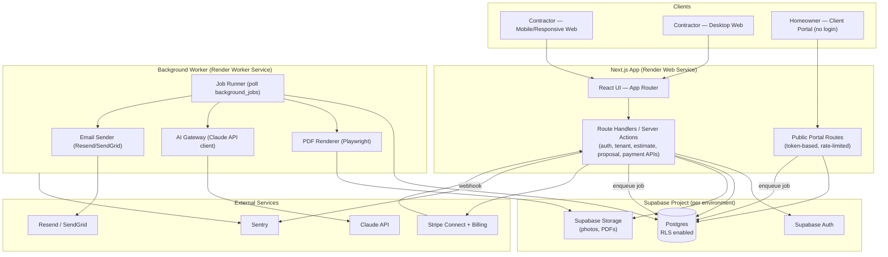
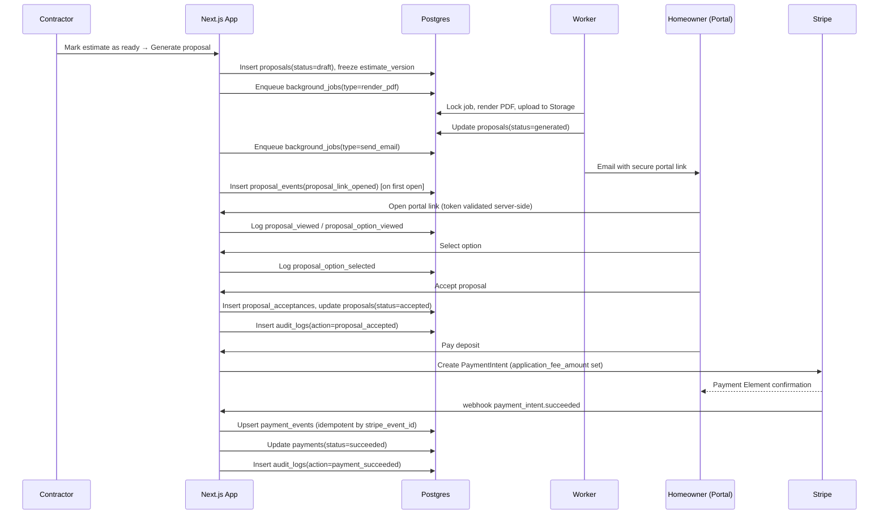
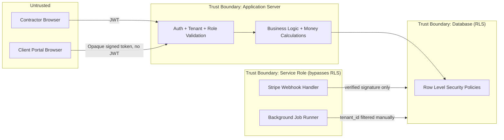

# 04 — System Architecture

## Stack decisions (evaluación del stack propuesto)

| Capa | Decisión | Justificación |
|---|---|---|
| Frontend | Next.js + TypeScript + React, mobile-first, App Router | Mantiene el stack propuesto. SSR/edge rendering ayuda al portal público (SEO no crítico, pero sí time-to-interactive en móvil) |
| Backend | Next.js Route Handlers (API interna) + Supabase (Postgres, Auth, Storage) | Evita levantar un backend separado en el MVP; reduce superficie operativa |
| Workers | Servicio Render separado (Node.js) para PDF, email, IA, jobs pesados | Aislar trabajo bloqueante (Chromium, llamadas a IA) del proceso web |
| Base de datos | Postgres (Supabase), RLS activo | Multi-tenant compartido, ver [ADR-001](adr/README.md) |
| Storage | Supabase Storage con signed URLs | Fotos, PDFs, adjuntos — evita exponer buckets públicos |
| Pagos | Stripe Connect (Standard) + Stripe Billing | Ver [09](09-payments-and-stripe.md) |
| Email | Resend (recomendado) o SendGrid | Resend tiene mejor DX y precio inicial; SendGrid como fallback si se requiere volumen/deliverability enterprise más adelante. **No bloqueante** |
| IA | Claude API detrás de un "AI Gateway" propio | Abstracción para poder cambiar de proveedor sin tocar el dominio — ver [10](10-ai-boundaries.md) |
| PDF | Playwright + Chromium en el worker | Renderiza el mismo HTML/CSS que el portal → consistencia visual garantizada |
| Monitoreo | Sentry (frontend + backend + workers) | Errores + performance tracing desde staging |
| Jobs | Tabla `background_jobs` en Postgres + worker con polling (ver [15](../docs/04-system-architecture.md#background-jobs)) | Evita añadir Redis/BullMQ en el MVP — ver [ADR-006](adr/README.md). Se migra a una cola dedicada si el volumen lo justifica |

### Cambios propuestos al stack original

| Cambio | Problema que resuelve | Complejidad añadida | Costo operativo | Por qué ahora y no después |
|---|---|---|---|---|
| Worker service separado en Render (no solo "background workers" genéricos) | Aislar tareas de CPU/latencia alta (PDF, IA) del request-response principal | Un servicio adicional a desplegar y monitorear | Bajo (Render worker es económico a baja escala) | Necesario desde el MVP porque PDF+IA sin aislamiento degradan la app principal |
| Jobs en Postgres en vez de Redis/BullMQ | Evita una pieza de infraestructura adicional | Ninguna nueva; reutiliza Postgres ya existente | Cero adicional | Volumen esperado en el MVP (cientos de jobs/día) no justifica Redis todavía |
| AI Gateway como capa de abstracción propia | Evita acoplar el dominio a la API específica de Claude | Una capa de indirección | Ninguno | Barato de hacer ahora, costoso de refactorizar después si cambia el proveedor o se agregan modelos |
| Client Portal como aplicación dentro del mismo Next.js (rutas públicas separadas), no un proyecto aparte | Reutiliza componentes de UI y el mismo pipeline de deploy | Ninguna significativa | Ninguno | Separar en otro proyecto sería sobre-ingeniería para el MVP |

## High-level architecture

## Event flow — proposal send & acceptance

## Security boundaries

**Principio clave:** todo lo que llega desde `Untrusted` se re-valida en el servidor (rol, tenant, propiedad del recurso, estado del documento) — el cliente nunca es la fuente de verdad para precio, permisos o estado. Ver detalle en [06-security-and-rls.md](06-security-and-rls.md).

## Deployment environments

| Ambiente | Propósito | Supabase project | Stripe mode | Notas |
|---|---|---|---|---|
| Development | Desarrollo local/individual | Proyecto Supabase de desarrollo compartido o local (Supabase CLI) | Test mode | Datos sintéticos, se puede resetear |
| Staging | QA, pruebas de integración, demo a stakeholders | Proyecto Supabase dedicado | Test mode | Espejo de producción, migraciones se prueban aquí primero |
| Production | Usuarios reales | Proyecto Supabase dedicado | Live mode | Acceso restringido, backups verificados |

Cada ambiente tiene sus propias claves de Stripe, Claude, Resend/SendGrid y Sentry DSN — nunca compartidas entre ambientes.

## Background jobs (resumen; detalle en [15 del prompt] incorporado aquí)

El worker consume `background_jobs` mediante `SELECT ... FOR UPDATE SKIP LOCKED` con backoff exponencial. Tipos de job en el MVP: `render_pdf`, `send_email`, `process_image`, `import_csv`, `ai_generate`, `stripe_reconciliation`. Ver columnas completas y estrategia de reintentos en [05-data-model.md](05-data-model.md#background_jobs) y [08-state-machines.md](08-state-machines.md#background-job).

## Dashboard metrics — fuente de datos exacta

| Métrica | Fórmula | Fuente | Periodo | Notas |
|---|---|---|---|---|
| Total estimated value | `SUM(estimate_options.total_price)` de la opción recomendada, para estimates en estados activos (`ready`, `sent`, `revised`) | `estimate_options` | Snapshot actual | Excluye `cancelled`/`rejected`/`expired` |
| Proposals sent | `COUNT(proposals)` con `status IN (sent, viewed, option_selected, accepted, declined)` | `proposals` | Por rango de fechas (`sent_at`) | No cuenta `draft`/`generated` |
| Proposal acceptance rate | `accepted / sent` (propuestas con `sent_at` en el periodo, numerador = las que llegaron a `accepted` sin importar cuándo) | `proposals` | Cohort por `sent_at` | Una propuesta `superseded` no cuenta como rechazo automático |
| Revenue collected | `SUM(payments.amount)` con `status = succeeded`, neto de reembolsos (`- SUM(refunded_amount)`) | `payments`, `payment_events` | Rango de fechas | Distinto de "revenue contracted" |
| Outstanding proposal value | `SUM` del precio de la opción aceptada de propuestas `accepted` sin `payments.status=succeeded` asociado | `proposals` + `payments` | Snapshot actual | — |
| Average estimate value | `AVG(estimate_options.total_price)` de opciones recomendadas en estimates `ready` o posteriores | `estimate_options` | Rango de fechas | — |
| Average time to acceptance | `AVG(proposal_acceptances.created_at - proposals.sent_at)` | `proposals`, `proposal_acceptances` | Rango de fechas | Excluye propuestas nunca aceptadas |
| Pipeline by status | `COUNT`/`SUM` de `opportunities` agrupado por `status` | `opportunities` | Snapshot actual | — |

Revisiones (`estimate_versions` > 1) no duplican el conteo de "proposals sent": se cuenta por `proposals.id`, y una revisión genera una nueva `proposals` row vinculada a la anterior vía `superseded_by`. Reembolsos siempre restan de "revenue collected", nunca de "revenue contracted".

## Open items for this deliverable

- Elección final entre Resend y SendGrid: no bloqueante, se decide en la fase de implementación de notificaciones.
