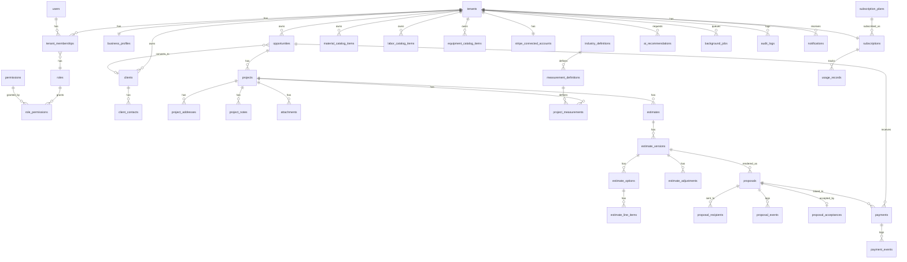

# 05 — Data Model

## Estrategias transversales

### Multi-tenancy strategy
**Shared database, shared schema, row-level isolation.** Cada tabla de dominio de negocio tiene una columna `tenant_id uuid NOT NULL REFERENCES tenants(id)` (directa o heredada por FK cuando la tabla cuelga de otra que ya tiene `tenant_id`, ej. `estimate_line_items` hereda tenant vía `estimate_versions`). Se descarta schema-per-tenant y database-per-tenant por costo operativo y de migración a esta escala. Ver [ADR-001](adr/README.md).

### Versioning strategy
`estimates` es el contenedor lógico; `estimate_versions` almacena cada versión (`version_number` incremental). Al enviar (`proposals.sent_at` no nulo referenciando esa versión), la versión queda **congelada**: cualquier intento de UPDATE a `estimate_versions`, `estimate_options` o `estimate_line_items` de una versión con `locked_at IS NOT NULL` es rechazado a nivel de servidor (y reforzado con un trigger de base de datos como segunda barrera). Modificaciones posteriores crean `version_number + 1`. `proposals` sigue el mismo patrón: una `proposals` row referencia una `estimate_version_id` específica; una revisión crea una nueva `proposals` row con `superseded_by`/`supersedes` apuntando a la anterior.

### Audit strategy
`audit_logs` es append-only (sin UPDATE/DELETE permitido, ni siquiera por Owner). Cada acción sensible (ver lista en [03](03-functional-requirements.md#audit--audit--compliance)) inserta una fila con `actor_user_id`, `tenant_id`, `action`, `entity_type`, `entity_id`, `before` (jsonb, opcional), `after` (jsonb, opcional), `created_at`, `ip_address`, `user_agent`. Los triggers de base de datos son la red de seguridad final para acciones financieras (precio, margen, pagos); la aplicación es responsable de las demás.

### RLS strategy (resumen; detalle y SQL en [06](06-security-and-rls.md))
Toda tabla con `tenant_id` tiene RLS habilitado y una policy que exige `tenant_id IN (SELECT tenant_id FROM tenant_memberships WHERE user_id = auth.uid())`. Las rutas del Client Portal **no** usan `auth.uid()` (el homeowner no tiene cuenta) — usan un endpoint de servidor con `service_role` que valida el token de forma explícita y filtra manualmente por tenant/proposal; nunca exponen la clave `service_role` al navegador.

### Money strategy
Todo valor monetario se almacena como **entero en centavos** (`bigint`, columna sufijo `_cents`) + `currency_code char(3)` (ISO 4217, `'USD'` fijo en MVP). Porcentajes (markup, margin, tax rate, waste %) se almacenan como `numeric(7,4)` representando una fracción (`0.3000` = 30%). Ver reglas de redondeo en [07-estimating-engine.md](07-estimating-engine.md).

### Soft delete
Se aplica `deleted_at timestamptz`, `deleted_by uuid` en entidades operativas donde un "borrado" es una decisión de negocio reversible: `clients`, `client_contacts`, `opportunities`, `projects`, `material_catalog_items`, `labor_catalog_items`, `equipment_catalog_items`, `attachments`, `notifications`. **Nunca** en: `payments`, `payment_events`, `proposal_acceptances`, `audit_logs`, `webhook_events`, `estimate_versions` ya enviadas — estas son registros financieros/legales que deben persistir físicamente; su "eliminación" lógica se maneja con un estado (`cancelled`, `voided`) en vez de un delete.

---

## Entity Relationship Overview

*(Diagrama simplificado a nivel de relación; no incluye todas las FKs de auditoría/soft-delete por legibilidad.)*

---

## Identity & Tenancy

### tenants
Purpose: raíz de aislamiento multi-tenant; representa la empresa contratista.
| Field | Type | Notes |
|---|---|---|
| id | uuid PK | |
| name | text | |
| industry_key | text | FK lógica a `industry_definitions.key`; `'painting'` en MVP |
| status | text | `active`, `suspended`, `cancelled` |
| created_at | timestamptz | |
| deleted_at | timestamptz null | soft delete a nivel de cuenta (baja definitiva del tenant) |

Tenant ownership: es la raíz — no tiene `tenant_id` propio. Indexes: `industry_key`. Audit: cambios de `status` van a `audit_logs`. Sensible: no. RLS: un usuario solo lee su(s) `tenants` vía `tenant_memberships`.

### business_profiles
Purpose: identidad comercial (marca) usada en PDFs/portal. 1:1 con `tenants`.
| Field | Type | Notes |
|---|---|---|
| tenant_id | uuid PK/FK | |
| legal_name, display_name | text | |
| logo_url | text | referencia a Storage |
| brand_color_primary | text | hex |
| default_deposit_percent | numeric(5,4) | default de negocio, override por estimate |
| default_min_margin | numeric(5,4) | usado por EST-005 |
| license_number, insurance_text | text | texto libre en MVP, no validado legalmente |

Soft delete: no (sigue el ciclo de vida del tenant). Sensible: `license_number` es dato de negocio, no PII crítica.

### users
Purpose: perfil de aplicación espejo de `auth.users` de Supabase (Supabase Auth es la fuente de verdad de credenciales).
| Field | Type | Notes |
|---|---|---|
| id | uuid PK | = `auth.users.id` |
| email | text | duplicado de auth para queries, sincronizado por trigger |
| full_name, phone, avatar_url | text | |
| created_at | timestamptz | |

Tenant ownership: ninguna directa (un `users` puede pertenecer a varios tenants). Sensible: email/phone son PII — ver clasificación en [06](06-security-and-rls.md).

### tenant_memberships
Purpose: relación N:M user↔tenant con rol.
| Field | Type | Notes |
|---|---|---|
| id | uuid PK | |
| tenant_id | uuid FK | |
| user_id | uuid FK | |
| role_id | uuid FK → roles | |
| status | text | `invited`, `active`, `removed` |
| invited_by | uuid FK users null | |
| created_at, removed_at | timestamptz | |

Unique: `(tenant_id, user_id)`. Check: un tenant debe conservar ≥1 membership `role=owner AND status=active` (aplicado en la capa de servicio, reforzado con trigger). Audit: cambios de rol/remoción. RLS: visible solo a miembros del mismo tenant.

### roles / permissions / role_permissions
Purpose: RBAC. `roles` es un catálogo fijo en el MVP (Owner, Admin, Estimator, Sales, Field Worker, Viewer) sembrado por sistema, no editable por tenant en el MVP. `permissions` es un catálogo de claves (`estimates.edit_cost`, `payments.refund`, etc. — ver matriz completa en [06](06-security-and-rls.md)). `role_permissions` es la matriz N:M.
Tenant ownership: ninguna (catálogo global del sistema). Nota: el esquema permite a futuro `tenant_role_overrides` sin romper compatibilidad, pero no se implementa en el MVP.

---

## CRM

### clients
Purpose: cliente final del contratista (no confundir con "tenant", que es el contratista mismo).
| Field | Type | Notes |
|---|---|---|
| id | uuid PK | |
| tenant_id | uuid FK | |
| type | text | `residential`, `commercial` |
| display_name | text | |
| billing_address | jsonb | |
| created_at, deleted_at, deleted_by | | soft delete |

Indexes: `(tenant_id)`, trigram sobre `display_name` para búsqueda. Sensible: dirección es PII moderada.

### client_contacts
Purpose: contactos de un cliente (relevante para comercial con property manager, etc.).
| Field | Type | Notes |
|---|---|---|
| id | uuid PK | |
| tenant_id | uuid FK | |
| client_id | uuid FK | |
| full_name, email, phone | text | |
| is_primary | boolean | |

Unique: un solo `is_primary=true` por `client_id` (constraint parcial). Sensible: PII (email/phone).

### opportunities
Purpose: **entidad unificada de Lead + Opportunity** (ver [ADR](adr/README.md) — se descarta una tabla `leads` separada; el pipeline completo vive aquí desde `new` hasta `won`/`lost`).
| Field | Type | Notes |
|---|---|---|
| id | uuid PK | |
| tenant_id | uuid FK | |
| client_id | uuid FK null | null mientras es solo lead; se vincula al calificar |
| status | text | ver [08](08-state-machines.md) |
| source | text | `referral`, `web_form`, `call`, `walk_in`, etc. |
| estimated_value_cents | bigint null | |
| assigned_to | uuid FK users null | |
| lost_reason | text null | |
| created_at, deleted_at, deleted_by | | soft delete = "archived" manual, distinto del status `archived` |

Indexes: `(tenant_id, status)`. Audit: cambios de estado. RLS: por tenant.

---

## Projects

### projects
Purpose: proyecto de trabajo vinculado a un cliente/oportunidad.
| Field | Type | Notes |
|---|---|---|
| id | uuid PK | |
| tenant_id | uuid FK | |
| client_id | uuid FK | |
| opportunity_id | uuid FK null | |
| industry_key | text | copiado del tenant al crear (permite futura mezcla de industrias por proyecto) |
| name | text | |
| project_type | text | `interior`, `exterior`, `interior_exterior` (painting-specific en MVP; ver [07](07-estimating-engine.md)) |
| created_at, deleted_at, deleted_by | | |

### project_addresses
Purpose: dirección física de trabajo (puede diferir de la del cliente).
| Field | Type | Notes |
|---|---|---|
| id | uuid PK | |
| tenant_id, project_id | uuid FK | |
| line1, line2, city, state, postal_code | text | |
| access_notes | text | |
| lat, lng | numeric null | opcional, futuro geocoding |

Sensible: dirección física — PII moderada, visible también en el Client Portal (el propio cliente).

### project_notes
Purpose: notas libres de campo/oficina.
| Field | Type | Notes |
|---|---|---|
| id | uuid PK | |
| tenant_id, project_id | uuid FK | |
| author_id | uuid FK users | |
| body | text | |
| visibility | text | `internal` (default) / futuro `client_visible` |
| created_at, deleted_at | | |

### attachments
Purpose: tabla polimórfica para fotos/archivos (proyecto, propuesta, catálogo).
| Field | Type | Notes |
|---|---|---|
| id | uuid PK | |
| tenant_id | uuid FK | |
| entity_type | text | `project`, `proposal`, `client`, etc. |
| entity_id | uuid | sin FK física (polimórfica); validada en servicio |
| storage_path | text | ruta en Supabase Storage |
| content_type, size_bytes | | |
| uploaded_by | uuid FK users | |
| created_at, deleted_at, deleted_by | | |

Indexes: `(tenant_id, entity_type, entity_id)`. RLS: signed URLs de Storage con expiración corta; el bucket nunca es público. Ver [06](06-security-and-rls.md).

---

## Industry Engine (Painting en MVP)

### industry_definitions
Purpose: catálogo de industrias soportadas y su configuración (plugin registry a nivel de datos).
| Field | Type | Notes |
|---|---|---|
| key | text PK | `'painting'` |
| display_name | text | |
| calculation_strategy_version | text | resuelve qué módulo de cálculo del código usar — ver [ADR-009](adr/README.md) |
| is_active | boolean | |

Tenant ownership: ninguna (catálogo global).

### measurement_definitions
Purpose: define qué campos de medición existen por industria/tipo de superficie (data-driven, evita `if industry === 'painting'` disperso en el código de UI).
| Field | Type | Notes |
|---|---|---|
| id | uuid PK | |
| industry_key | text FK | |
| surface_category | text | `interior_wall`, `exterior_siding`, etc. |
| unit | text | `sqft`, `linear_ft`, `each` |
| input_schema | jsonb | describe campos requeridos (length, height, openings...) |

Tenant ownership: ninguna en el MVP (definiciones globales por industria); el esquema admite `tenant_id null` para overrides futuros por tenant sin migración.

### project_measurements
Purpose: mediciones reales capturadas para un proyecto.
| Field | Type | Notes |
|---|---|---|
| id | uuid PK | |
| tenant_id, project_id | uuid FK | |
| measurement_definition_id | uuid FK | |
| values | jsonb | según `input_schema` (length, width, height, openings, coats, condition, etc.) |
| computed_net_area | numeric null | resultado calculado, cacheado para performance |
| created_by | uuid FK users | |
| created_at, deleted_at | | |

Immutable: una vez referenciada por un `estimate_line_items` (vía snapshot), la medición original puede seguir editándose para el proyecto, pero **no altera retroactivamente** el line item ya calculado — ver estrategia de snapshot abajo.

---

## Catalog & Pricing

### material_catalog_items / labor_catalog_items / equipment_catalog_items
Purpose: catálogo propio del tenant, base para line items de estimate. Estructura común (tabla por tipo para claridad de dominio, en vez de una única tabla polimórfica con columnas nulas):
| Field | Type | Notes |
|---|---|---|
| id | uuid PK | |
| tenant_id | uuid FK | |
| name, description | text | |
| unit | text | `gallon`, `sqft`, `hour`, `each` |
| unit_cost_cents | bigint | costo para el contratista |
| default_unit_price_cents | bigint null | precio sugerido (antes de markup del estimate) |
| supplier_name | text null | |
| price_source_id | uuid FK price_sources null | |
| price_updated_at | timestamptz | |
| is_active | boolean | |
| created_at, deleted_at, deleted_by | | |

### price_sources
Purpose: procedencia del precio (manual, importación CSV, futuro feed de proveedor).
| Field | Type | Notes |
|---|---|---|
| id | uuid PK | |
| tenant_id | uuid FK null | null = fuente global del sistema (ej. plantillas iniciales) |
| type | text | `manual`, `csv_import`, `vendor_api` (futuro) |
| label | text | |

**Decisión de simplificación respecto al modelo preliminar del prompt:** se elimina la tabla `price_snapshots` independiente. El snapshot de precio vive embebido directamente en `estimate_line_items` (nombre, unidad, costo, precio, supplier, fecha, markup, tax status en el momento de agregarse) — una tabla de snapshots separada sería redundante porque cada line item **es** el snapshot y nunca se comparte entre estimates.

---

## Estimating

### estimates
Purpose: contenedor lógico de un estimado (agrupa versiones).
| Field | Type | Notes |
|---|---|---|
| id | uuid PK | |
| tenant_id, project_id | uuid FK | |
| current_version_id | uuid FK estimate_versions null | apunta a la versión vigente |
| status | text | agregado/derivado de la versión vigente — ver [08](08-state-machines.md) |
| created_at, deleted_at, deleted_by | | |

### estimate_versions
Purpose: versión inmutable una vez enviada.
| Field | Type | Notes |
|---|---|---|
| id | uuid PK | |
| tenant_id, estimate_id | uuid FK | |
| version_number | int | incremental por `estimate_id` |
| status | text | `draft`, `calculating`, `ready`, `sent`, `revised`, `accepted`, `rejected`, `expired`, `cancelled` |
| min_margin_override | numeric(7,4) null | |
| locked_at | timestamptz null | set cuando se genera una `proposals` a partir de esta versión |
| created_by | uuid FK users | |
| created_at | timestamptz | |

Unique: `(estimate_id, version_number)`. Immutable: cuando `locked_at IS NOT NULL`, ningún campo de esta fila ni de sus `estimate_options`/`estimate_line_items` puede modificarse (trigger `RAISE EXCEPTION`). Audit: creación, envío, cada transición de estado.

### estimate_options
Purpose: Good/Better/Best dentro de una versión.
| Field | Type | Notes |
|---|---|---|
| id | uuid PK | |
| tenant_id, estimate_version_id | uuid FK | |
| tier | text | `good`, `better`, `best`, o nombre custom |
| display_name | text | editable por el contratista |
| is_recommended | boolean | único `true` por versión (constraint parcial) |
| is_hidden | boolean | permite ocultar sin borrar |
| sort_order | int | |
| target_margin | numeric(7,4) null | |
| subtotal_cost_cents, subtotal_price_cents, total_price_cents | bigint | derivados, recalculados al modificar line items mientras no esté locked |
| warranty_text, timeline_text | text | |

### estimate_line_items
Purpose: partidas individuales dentro de una opción; **snapshot inmutable** del catálogo.
| Field | Type | Notes |
|---|---|---|
| id | uuid PK | |
| tenant_id, estimate_option_id | uuid FK | |
| category | text | `material`, `labor`, `equipment`, `subcontractor`, `permit`, `disposal`, `travel` |
| catalog_item_id | uuid null | referencia informativa, no de integridad fuerte (el catálogo puede borrarse/cambiar sin romper el line item) |
| name_snapshot, unit_snapshot, supplier_snapshot | text | |
| quantity | numeric | |
| unit_cost_cents_snapshot, unit_price_cents_snapshot | bigint | |
| markup_snapshot | numeric(7,4) null | |
| tax_status_snapshot | text | `taxable`, `exempt` |
| price_date_snapshot | timestamptz | |
| sort_order | int | |

Immutable: una vez que `estimate_versions.locked_at` está seteado, ver arriba.

### estimate_adjustments
Purpose: ajustes a nivel de versión/opción — **incluye impuestos** (se elimina `estimate_taxes` como tabla separada del modelo preliminar; un `type='tax'` cubre el caso sin duplicar estructura).
| Field | Type | Notes |
|---|---|---|
| id | uuid PK | |
| tenant_id, estimate_option_id | uuid FK | |
| type | text | `overhead`, `contingency`, `tax`, `discount`, `fee` |
| calculation_mode | text | `percentage` \| `fixed_amount` |
| value | numeric(9,4) | fracción si es `percentage`, cents si es `fixed_amount` (columna `value_cents` alterna, ver [07](07-estimating-engine.md) para el orden de aplicación) |
| sort_order | int | orden de aplicación explícito |

---

## Proposals & Client Portal

### proposals
Purpose: documento enviable al cliente, referencia a una `estimate_version` congelada.
| Field | Type | Notes |
|---|---|---|
| id | uuid PK | |
| tenant_id, estimate_version_id | uuid FK | |
| status | text | ver [08](08-state-machines.md) |
| pdf_storage_path | text null | generado async |
| deposit_percent_snapshot | numeric(5,4) null | copiado de business_profile al momento de generar, editable antes de enviar |
| supersedes_proposal_id | uuid FK proposals null | |
| generated_at, sent_at, expires_at | timestamptz | |
| created_by | uuid FK users | |

Immutable: tras `sent_at`, no editable (crear nueva versión + nueva proposal en su lugar).

### proposal_recipients
Purpose: a quién se envió (soporta múltiples destinatarios, ej. ambos cónyuges).
| Field | Type | Notes |
|---|---|---|
| id | uuid PK | |
| tenant_id, proposal_id | uuid FK | |
| client_contact_id | uuid FK null | |
| email | text | |
| access_token_hash | text | **hash** del token, nunca el token en claro (ver [06](06-security-and-rls.md)) |
| token_expires_at | timestamptz | |
| revoked_at | timestamptz null | |

Sensible: `access_token_hash` es equivalente a una credencial — tratado como secreto.

### proposal_events
Purpose: telemetría de interacción del cliente (append-only).
| Field | Type | Notes |
|---|---|---|
| id | uuid PK | |
| tenant_id, proposal_id | uuid FK | |
| recipient_id | uuid FK proposal_recipients null | |
| event_type | text | `proposal_link_opened`, `proposal_viewed`, `proposal_option_viewed`, `proposal_option_selected`, `proposal_accepted`, `payment_started`, `payment_completed` |
| metadata | jsonb | ej. `option_id` visto |
| ip_address, user_agent | text | |
| created_at | timestamptz | |

### proposal_acceptances
Purpose: registro legal-operativo de la aceptación (click-to-accept, no firma certificada — ver límite en [01](01-mvp-scope.md)).
| Field | Type | Notes |
|---|---|---|
| id | uuid PK | |
| tenant_id, proposal_id | uuid FK | |
| selected_option_id | uuid FK estimate_options | |
| accepted_by_name | text | tal como lo ingresa el cliente |
| ip_address, user_agent | text | |
| created_at | timestamptz | inmutable, nunca se actualiza ni se borra |

Unique: un `proposal_id` solo puede tener una acceptance activa (una nueva versión de proposal es una nueva fila).

---

## Payments & Billing

### payments
Purpose: pago del cliente final al contratista (depósito o pago completo) vía Stripe Connect.
| Field | Type | Notes |
|---|---|---|
| id | uuid PK | |
| tenant_id, opportunity_id | uuid FK | se ancla a `opportunity_id`, no a `proposal_id`/`estimate_version_id`, para sobrevivir revisiones — ver journey 10 en [02](02-personas-and-journeys.md) |
| proposal_id | uuid FK null | referencia informativa a la propuesta que originó el cobro |
| type | text | `deposit`, `balance`, `full_payment` |
| status | text | ver [08](08-state-machines.md) |
| amount_cents, currency_code | | |
| application_fee_cents | bigint | comisión de Scopevia |
| stripe_payment_intent_id | text | unique |
| idempotency_key | text | unique, generado por el cliente de la request |
| created_at | timestamptz | |

Immutable: nunca soft-deleted; corrección se hace vía `payment_events` + reembolso.

### payment_events
Purpose: log crudo de eventos de Stripe relacionados a un payment (auditoría + reconciliación).
| Field | Type | Notes |
|---|---|---|
| id | uuid PK | |
| tenant_id, payment_id | uuid FK | |
| stripe_event_id | text | unique — clave de idempotencia contra reprocesos |
| type | text | `payment_intent.succeeded`, `charge.refunded`, `charge.dispute.created`, etc. |
| raw_payload | jsonb | |
| created_at | timestamptz | |

### stripe_connected_accounts
Purpose: cuenta Stripe Connect del tenant (1:1).
| Field | Type | Notes |
|---|---|---|
| tenant_id | uuid PK/FK | |
| stripe_account_id | text unique | |
| charges_enabled, payouts_enabled | boolean | |
| onboarding_status | text | `not_started`, `pending`, `complete`, `restricted` |
| updated_at | timestamptz | |

Sensible: `stripe_account_id` no es secreto por sí mismo, pero se trata como dato restringido (solo Owner/Admin lo ven).

### subscription_plans / subscriptions / usage_records
Purpose: suscripción SaaS del tenant a Scopevia (independiente de Stripe Connect).
| Field | Type | Notes |
|---|---|---|
| subscription_plans.id | uuid PK | catálogo global |
| subscriptions.tenant_id | uuid PK/FK | 1:1 con tenant |
| subscriptions.stripe_subscription_id | text unique | en la cuenta plataforma de Stripe, no la del contratista |
| subscriptions.status | text | `trialing`, `active`, `past_due`, `canceled` |
| usage_records | tenant_id, metric, period, value | ej. `proposals_sent` por mes, para límites de plan |

---

## Notifications

### notifications / notification_preferences
Purpose: registro de notificaciones enviadas y preferencias por usuario.
| Field | Type | Notes |
|---|---|---|
| notifications.id | uuid PK | |
| notifications.tenant_id, user_id null | | null si es al cliente final (no tiene `users` row) |
| notifications.channel | text | `email` (MVP), `sms` (futuro) |
| notifications.type | text | `proposal_sent`, `proposal_accepted`, `payment_received` |
| notifications.status | text | `queued`, `sent`, `failed` |
| notification_preferences.user_id, type, enabled | | |

---

## AI

### ai_recommendations
Purpose: log completo de cada uso de IA — ver detalle en [10-ai-boundaries.md](10-ai-boundaries.md).
| Field | Type | Notes |
|---|---|---|
| id | uuid PK | |
| tenant_id, user_id | uuid FK | |
| feature | text | `scope_description`, `missing_line_items`, etc. |
| model, prompt_version | text | |
| input_summary | jsonb | **no** el prompt completo con PII innecesaria — ver clasificación de datos |
| output | jsonb | |
| token_usage_input, token_usage_output | int | |
| estimated_cost_cents | bigint | |
| decision | text | `pending`, `accepted`, `rejected`, `edited` |
| created_at, decided_at | timestamptz | |

---

## Jobs & Audit

### background_jobs
Purpose: cola de trabajo (ver [04](04-system-architecture.md) y [15 del prompt]).
| Field | Type | Notes |
|---|---|---|
| id | uuid PK | |
| tenant_id | uuid FK | |
| job_type | text | |
| status | text | `queued`, `processing`, `completed`, `failed`, `retry_scheduled`, `dead_letter` |
| payload, result | jsonb | |
| attempt_count, max_attempts | int | |
| next_attempt_at, locked_at | timestamptz null | |
| locked_by | text | id del worker |
| last_error | text null | |
| idempotency_key | text unique null | |
| created_at, completed_at | timestamptz | |

Indexes: `(status, next_attempt_at)` parcial donde `status IN ('queued','retry_scheduled')` para el polling eficiente.

### audit_logs
Purpose: ver estrategia arriba. Append-only, sin soft delete (no aplica: nunca se borra).
| Field | Type | Notes |
|---|---|---|
| id | uuid PK | |
| tenant_id | uuid FK | |
| actor_user_id | uuid FK users null | null si el actor es "system" o el cliente vía portal |
| actor_type | text | `user`, `system`, `client_portal`, `webhook` |
| action | text | |
| entity_type, entity_id | text, uuid | |
| before, after | jsonb null | |
| ip_address, user_agent | text null | |
| created_at | timestamptz | |

### webhook_events
Purpose: deduplicación de webhooks entrantes (Stripe hoy; extensible).
| Field | Type | Notes |
|---|---|---|
| id | uuid PK | |
| provider | text | `stripe` |
| provider_event_id | text | unique junto con `provider` |
| payload | jsonb | |
| processed_at | timestamptz null | |
| created_at | timestamptz | |

Nota: `webhook_events` no tiene `tenant_id` directo porque el tenant se resuelve al procesar el payload (el `stripe_account_id` del evento mapea a `stripe_connected_accounts.tenant_id`).

## Open items for this deliverable

- Definir si `role_permissions` admite overrides por tenant en el MVP o se pospone — **no bloqueante**, el esquema ya lo permite sin migración disruptiva (ver [12-delivery-roadmap.md](12-delivery-roadmap.md)).
