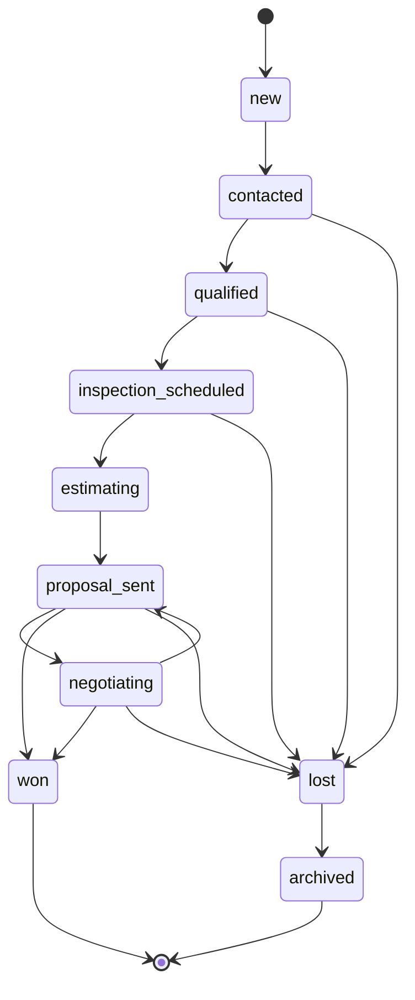
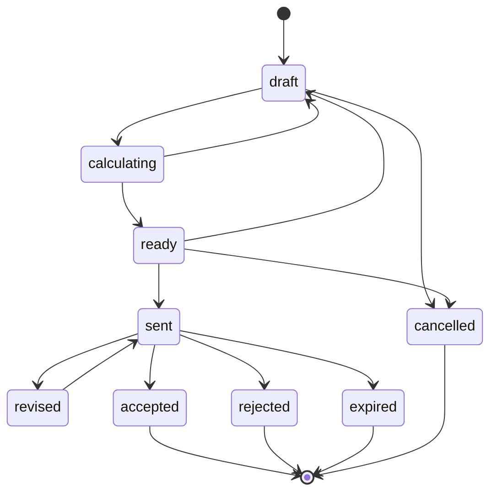
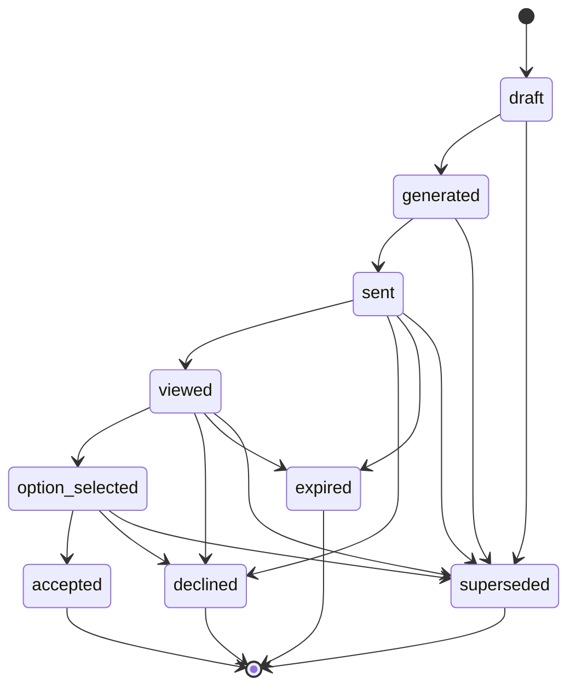
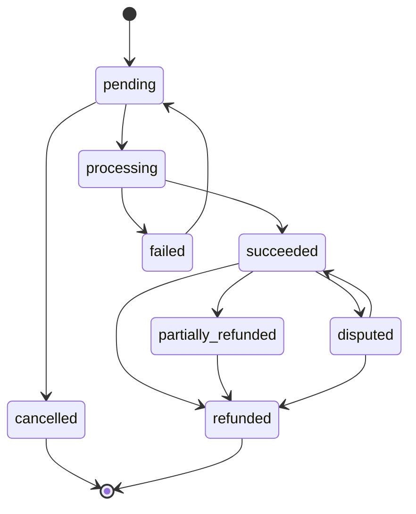
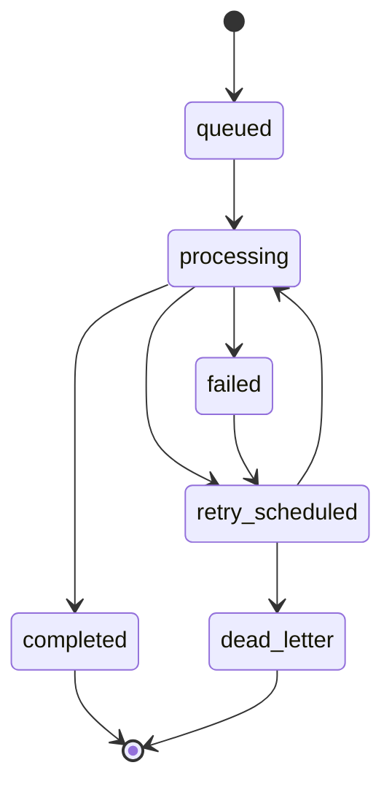
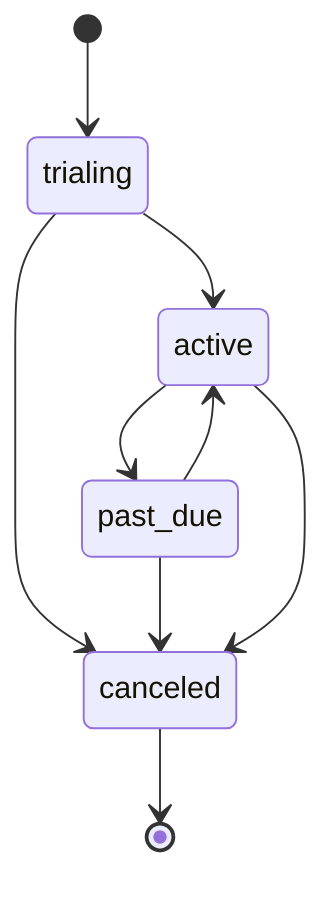

# 08 — State Machines

Nota de diseño: se **fusiona** "Lead" y "Opportunity" en una única entidad/máquina de estados (`opportunities`) — ver [ADR](adr/README.md). Mantener dos tablas y dos máquinas de estado para lo que es el mismo objeto de negocio (una oportunidad comercial que evoluciona) habría duplicado lógica sin beneficio real en el MVP.

## Opportunity

| From | To | Actor autorizado | Condiciones | Efectos secundarios | Evento | Reversible |
|---|---|---|---|---|---|---|
| `new` | `contacted` | Sales/Estimator/Admin/Owner | — | — | `opportunity.contacted` | Sí (manual) |
| `contacted` | `qualified` | Sales/Estimator/Admin/Owner | Datos mínimos de contacto completos | — | `opportunity.qualified` | Sí |
| `contacted`/`qualified`/`inspection_scheduled` | `lost` | Sales/Estimator/Admin/Owner | Requiere `lost_reason` | — | `opportunity.lost` | Sí (reabrir vuelve a `contacted`) |
| `qualified` | `inspection_scheduled` | Sales/Estimator/Admin/Owner | Fecha de inspección registrada | — | `opportunity.inspection_scheduled` | Sí |
| `inspection_scheduled` | `estimating` | Estimator/Admin/Owner | Al menos un `projects` creado | Crea/vincula `clients` + `projects` si no existen | `opportunity.estimating` | Sí |
| `estimating` | `proposal_sent` | Sistema (automático) | Se envía la primera `proposals` del proyecto | — | `opportunity.proposal_sent` | No (es un reflejo del envío real) |
| `proposal_sent` | `negotiating` | Sales/Estimator/Admin/Owner | Cliente solicitó cambios | — | `opportunity.negotiating` | Sí |
| `negotiating` | `proposal_sent` | Sistema (automático) | Se envía nueva versión de propuesta | — | `opportunity.proposal_sent` | — |
| `proposal_sent`/`negotiating` | `won` | Sistema (automático) | `proposal_acceptances` registrada | — | `opportunity.won` | No (ver "Estimate revision" en journeys si se requiere reabrir excepcionalmente vía soporte) |
| `proposal_sent`/`negotiating` | `lost` | Sales/Estimator/Admin/Owner | Requiere `lost_reason` | — | `opportunity.lost` | Sí |
| `lost` | `archived` | Sistema (automático, tras 90 días) o manual | — | — | `opportunity.archived` | No |

## Estimate (a nivel de `estimate_versions`)

| From | To | Actor | Condiciones | Efectos secundarios | Evento | Reversible |
|---|---|---|---|---|---|---|
| `draft` | `calculating` | Sistema | Se dispara recálculo tras cambios de line items | Recalcula totales | `estimate.calculating` | Sí (interno, transitorio) |
| `calculating` | `ready` | Sistema | ≥1 opción con ≥1 line item cada una, `Total Cost > 0` | Persiste snapshots de totales | `estimate.ready` | Sí (vuelve a `draft` si se edita) |
| `ready` | `draft` | Estimator+ | Usuario edita tras marcar ready | — | `estimate.reopened` | — |
| `ready` | `sent` | Sistema (automático) | Se genera `proposals` a partir de esta versión | **Congela** la versión (`locked_at`) | `estimate.sent` | No |
| `sent` | `revised` | Estimator+ | Se crea nueva `estimate_versions` a partir de esta | La versión `sent` permanece inmutable; nueva versión nace en `draft` | `estimate.revision_created` | No (la anterior no cambia) |
| `sent` | `accepted` | Sistema (automático) | `proposal_acceptances` sobre la `proposals` vinculada | — | `estimate.accepted` | No |
| `sent` | `rejected` | Client (vía portal) o Admin/Owner manual | Cliente declina explícitamente | — | `estimate.rejected` | Sí (vía `revised`) |
| `sent` | `expired` | Sistema (automático) | `proposals.expires_at` alcanzado sin aceptación | — | `estimate.expired` | Sí (vía `revised`) |
| `draft`/`ready` | `cancelled` | Admin/Owner | Proyecto cancelado antes de enviar | Requiere permiso `records.delete_or_archive` | `estimate.cancelled` | No |

## Proposal

| From | To | Actor | Condiciones | Efectos secundarios | Evento | Reversible |
|---|---|---|---|---|---|---|
| `draft` | `generated` | Sistema | Job `render_pdf` completado | `pdf_storage_path` seteado | `proposal.generated` | Sí (regenerar PDF) |
| `generated` | `sent` | Estimator+/Sales | Permiso `proposals.send` | Email enviado, token creado, `sent_at` seteado | `proposal.sent` | No |
| `sent` | `viewed` | Cliente (portal) | Primer acceso válido | `proposal_events(proposal_viewed)` | `proposal.viewed` | — |
| `viewed` | `option_selected` | Cliente (portal) | Selecciona una opción | `proposal_events(proposal_option_selected)` | `proposal.option_selected` | Sí (puede cambiar antes de aceptar) |
| `option_selected` | `accepted` | Cliente (portal) | Confirma aceptación | Crea `proposal_acceptances`; dispara `opportunity.won` y `estimate.accepted` | `proposal.accepted` | No |
| `sent`/`viewed`/`option_selected` | `declined` | Cliente (portal) o manual | — | — | `proposal.declined` | Sí (vía nueva versión) |
| `sent`/`viewed`/`option_selected` | `expired` | Sistema (automático) | `expires_at` alcanzado | — | `proposal.expired` | Sí (vía nueva versión) |
| cualquier estado no terminal | `superseded` | Sistema (automático) | Se genera una nueva `proposals` para la misma `estimate_id` | El link anterior se invalida (no borra `proposal_events` históricos) | `proposal.superseded` | No |

## Payment

| From | To | Actor | Condiciones | Efectos secundarios | Evento | Reversible |
|---|---|---|---|---|---|---|
| `pending` | `processing` | Sistema (Stripe webhook) | `payment_intent.processing` | — | `payment.processing` | — |
| `processing` | `succeeded` | Sistema (Stripe webhook) | `payment_intent.succeeded`, idempotente por `stripe_event_id` | Notifica al contratista; actualiza dashboard | `payment.succeeded` | No directamente (se maneja vía refund) |
| `processing` | `failed` | Sistema (Stripe webhook) | `payment_intent.payment_failed` | Notifica al cliente en portal | `payment.failed` | Sí (`pending` para reintento) |
| `succeeded` | `partially_refunded` | Admin/Owner | Permiso `payments.refund` | Registra `payment_events` | `payment.partially_refunded` | Sí (hasta reembolso total) |
| `succeeded`/`partially_refunded` | `refunded` | Admin/Owner o Stripe (dispute perdido) | — | — | `payment.refunded` | No |
| `succeeded` | `disputed` | Sistema (Stripe webhook) | `charge.dispute.created` | Notifica urgente al Owner | `payment.disputed` | Sí (se resuelve a favor o en contra) |
| `pending` | `cancelled` | Sistema o Admin | Cliente abandona el flujo de pago sin completar | — | `payment.cancelled` | No |

## Background Job

| From | To | Actor | Condiciones | Efectos secundarios | Evento | Reversible |
|---|---|---|---|---|---|---|
| `queued` | `processing` | Worker | `SELECT ... FOR UPDATE SKIP LOCKED` exitoso | `locked_at`, `locked_by` seteados | `job.started` | — |
| `processing` | `completed` | Worker | Job ejecutado sin error | `result` guardado, `completed_at` seteado | `job.completed` | No |
| `processing` | `failed` | Worker | Excepción durante ejecución | `last_error` guardado, `attempt_count += 1` | `job.failed` | — |
| `failed` | `retry_scheduled` | Sistema | `attempt_count < max_attempts` | `next_attempt_at` = ahora + backoff exponencial | `job.retry_scheduled` | — |
| `retry_scheduled` | `processing` | Worker | `next_attempt_at <= now()` | — | `job.started` | — |
| `failed`/`retry_scheduled` | `dead_letter` | Sistema | `attempt_count >= max_attempts` | Alerta a Sentry/on-call | `job.dead_letter` | Manual (reintento forzado por operador) |

Backoff sugerido: `2^attempt_count` minutos, con tope máximo (ej. 60 min) y `max_attempts` por tipo de job (ej. 5 para `send_email`, 3 para `render_pdf`).

## Subscription (billing del tenant hacia Scopevia)

| From | To | Actor | Condiciones | Efectos secundarios | Evento | Reversible |
|---|---|---|---|---|---|---|
| `trialing` | `active` | Sistema (Stripe webhook) | Primer cobro exitoso o fin de trial con método de pago válido | — | `subscription.activated` | — |
| `trialing` | `canceled` | Usuario o sistema | Trial vence sin método de pago, o cancelación manual | Acceso degradado según política de plan | `subscription.canceled` | Sí (nueva suscripción) |
| `active` | `past_due` | Sistema (Stripe webhook) | Cobro fallido | Notificación + periodo de gracia | `subscription.past_due` | Sí |
| `past_due` | `active` | Sistema (Stripe webhook) | Cobro reintentado exitoso | — | `subscription.reactivated` | — |
| `past_due`/`active` | `canceled` | Usuario o sistema | Cancelación explícita o agotamiento de reintentos de Stripe | Acceso degradado tras el fin del periodo pagado | `subscription.canceled` | Sí |

## Open items for this deliverable

- Duración exacta del periodo de gracia en `past_due` y política de "acceso degradado" (solo lectura vs. bloqueo total) — decisión de producto, no bloqueante para el diseño.
