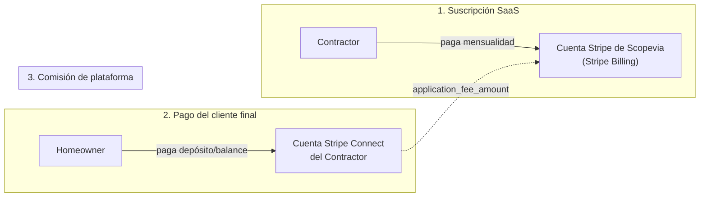

# 09 — Payments and Stripe

## Tres flujos de dinero distintos (nunca mezclarlos conceptualmente)

1. **Suscripción del contratista a Scopevia** — Stripe Billing en la cuenta plataforma de Scopevia. No involucra Connect.
2. **Pago del cliente final al contratista** — Stripe Connect, los fondos van a la cuenta conectada del contratista.
3. **Comisión de plataforma** — un `application_fee_amount` retenido automáticamente del pago #2 hacia la cuenta de Scopevia, en la misma transacción (no un pago separado).

## Modelo de Stripe Connect: Standard (recomendado para el MVP)

| Opción | Onboarding | Responsabilidad de compliance (KYC, disputas) | Complejidad de integración | Recomendación |
|---|---|---|---|---|
| **Standard** | Hospedado por Stripe (Stripe-hosted) | Stripe + el contratista directamente | Baja | ✅ MVP |
| Express | Hospedado por Stripe, con más control de marca | Compartida | Media | Considerar en fase 2 si se quiere marca blanca |
| Custom | Construido 100% por Scopevia | Scopevia asume compliance completo | Alta | ❌ Descartado para el MVP — no se debe asumir que es necesario |

Justificación: Custom requiere que Scopevia maneje KYC, disputas y soporte financiero directamente — inviable para una startup temprana. Standard delega esa responsabilidad a Stripe y al propio contratista (que ya tiene o puede crear su cuenta de Stripe), minimizando riesgo regulatorio y de soporte.

## Componentes del modelo de datos (ver detalle completo en [05](05-data-model.md))

- `stripe_connected_accounts` — 1:1 con `tenants`, guarda `stripe_account_id`, `charges_enabled`, `payouts_enabled`, `onboarding_status`.
- `payments` — pago del cliente final, ancla a `opportunity_id` (sobrevive revisiones de estimate/proposal).
- `payment_events` — log crudo de eventos de Stripe, deduplicado por `stripe_event_id`.
- `subscriptions` / `subscription_plans` / `usage_records` — suscripción del tenant a Scopevia.

## Flujo de onboarding (Standard, hospedado)

1. Owner hace clic en "Connect Stripe" desde Settings.
2. Backend crea (si no existe) un `stripe_account_id` tipo `standard` y genera un **Account Link** de onboarding.
3. El contratista completa el onboarding en el dominio de Stripe (KYC, cuenta bancaria).
4. Stripe redirige de vuelta; el backend consulta el estado de la cuenta (`charges_enabled`, `payouts_enabled`) y lo persiste.
5. Mientras `charges_enabled = false`, la UI bloquea el botón de "Request Deposit" en propuestas, con mensaje explicativo — no se debe permitir generar un Payment Intent contra una cuenta no habilitada.

## Flujo de cobro de depósito (cliente final)

1. Desde el Client Portal, tras aceptar la propuesta, el cliente ve el monto del depósito (`deposit_percent_snapshot × Final Price` de la opción aceptada).
2. El backend crea un **PaymentIntent** en la cuenta conectada del contratista:
   - `amount` = monto del depósito en cents.
   - `application_fee_amount` = comisión de Scopevia (fija o % configurable por plan).
   - `transfer_data.destination` = `stripe_account_id` del tenant (o se crea directamente "on behalf of" la cuenta conectada, según el patrón de "direct charges" — preferido para Standard porque el contratista es el merchant of record).
   - `metadata` = `{ tenant_id, opportunity_id, proposal_id }` para reconciliación.
   - Idempotency key = hash determinístico de `(proposal_id, amount, type)` para evitar doble cobro si el cliente reintenta.
3. El pago se confirma vía **Payment Element** embebido en el portal (no se redirige a un dominio externo, mejor UX mobile).
4. El backend **no marca el pago como exitoso desde la respuesta del navegador** — espera el webhook `payment_intent.succeeded` como fuente de verdad (evita fraude de "confirmación falsa" del cliente y cubre casos de fallos de red post-pago).

## Webhooks — eventos mínimos a manejar

| Evento Stripe | Efecto en Scopevia |
|---|---|
| `account.updated` | Actualiza `stripe_connected_accounts` (charges_enabled, payouts_enabled, onboarding_status) |
| `payment_intent.succeeded` | `payments.status = succeeded`, notifica al contratista, dispara `proposal.accepted`→`won` si no estaba ya |
| `payment_intent.payment_failed` | `payments.status = failed`, notifica al cliente en portal |
| `charge.refunded` | `payments.status = refunded/partially_refunded` |
| `charge.dispute.created` | `payments.status = disputed`, alerta urgente al Owner |
| `charge.dispute.closed` | Actualiza según `status` del dispute (won/lost) |
| `invoice.paid` / `invoice.payment_failed` (cuenta plataforma) | Actualiza `subscriptions.status` |
| `customer.subscription.updated/deleted` (cuenta plataforma) | Sincroniza `subscriptions.status` |

Todo webhook: verificado por firma → insertado en `webhook_events` (dedup por `provider_event_id`) → encolado como `background_jobs` → procesado por el worker con el efecto de negocio. Ver [06-security-and-rls.md](06-security-and-rls.md#webhook-security-stripe).

## Idempotencia end-to-end

| Operación | Clave de idempotencia |
|---|---|
| Creación de PaymentIntent | `Idempotency-Key` header de Stripe = hash de `(proposal_id, amount_cents, type)` |
| Procesamiento de webhook | `webhook_events.provider_event_id` unique |
| Reintento de background job de cobro | `background_jobs.idempotency_key` |

## Reembolsos y disputas

- Reembolso total/parcial: acción manual con permiso `payments.refund`, ejecutada vía Stripe Refund API, reflejada por webhook (no se asume éxito desde la llamada síncrona sin confirmar vía webhook, igual que el cobro).
- Disputas (`chargebacks`): Scopevia solo refleja el estado; la evidencia y resolución de la disputa ocurre en el dashboard de Stripe del contratista (fuera del alcance del MVP construir un flujo propio de evidencia).
- Reembolsos siempre generan `audit_logs` y restan de "revenue collected" en el dashboard (ver [04](04-system-architecture.md)).

## Fallos de pago y reconciliación

- Job periódico `stripe_reconciliation`: compara `payments` en estado no terminal por más de X horas contra el estado real en Stripe API, y corrige discrepancias (cubre el caso de un webhook perdido pese a la garantía de reintentos de Stripe).
- Pagos fallidos no bloquean el estado `accepted` de la propuesta — el trabajo está ganado, el cobro es un proceso separado con su propia máquina de estados (ver [08](08-state-machines.md)).

## Qué NO almacena Scopevia

- Números de tarjeta, CVC, cuentas bancarias completas — estos solo existen en Stripe (vía Payment Element/Stripe.js, tokenizados en el navegador del cliente, nunca tocan el servidor de Scopevia).
- Certificaciones PCI: al no tocar datos de tarjeta directamente, Scopevia opera bajo **SAQ A** (el nivel más bajo de auto-evaluación PCI DSS), gracias a usar componentes embebidos de Stripe. **Confirmar con Stripe/asesor de compliance antes de lanzar** — no es asesoría legal definitiva.

## Moneda

- Solo `USD` en el MVP, tanto para pagos de clientes finales como para suscripciones. El modelo de datos reserva `currency_code` para expansión futura sin migración estructural.

## Open items for this deliverable

- % exacto de `application_fee_amount` (fijo vs. variable por plan) — decisión de pricing de negocio, no bloqueante para el diseño técnico.
- Confirmación con Stripe sobre el patrón exacto "direct charges" vs. "destination charges" según el volumen esperado — recomendación técnica (`direct charges` con Standard) sujeta a validación final en fase de implementación.
