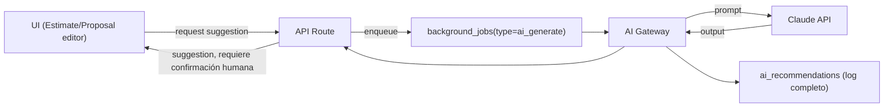

# 10 — AI Boundaries

## Principio rector

La IA es una **función de asistencia**, nunca de autoridad. Ver límites duros ya establecidos en el prompt maestro (sección 4): la IA nunca aprueba precios, define precio final, altera estimados enviados, ejecuta pagos, cambia márgenes sin autorización, envía propuestas sin confirmación, ni acepta contratos en nombre del usuario. Estos límites se aplican **a nivel de arquitectura** (la IA no tiene, técnicamente, permisos de escritura directa sobre esas entidades), no solo como instrucción de prompt.

## Arquitectura: AI Gateway

Toda llamada a un modelo de IA pasa por una capa propia (`AI Gateway`) en el worker, no directamente desde la UI ni desde rutas de negocio. Esto permite:

- Cambiar de proveedor (Claude → otro) sin tocar el dominio.
- Aplicar límites de costo/uso por tenant de forma centralizada.
- Loggear **toda** llamada en `ai_recommendations` de forma uniforme.
- Degradar con gracia si el proveedor está caído (feature flag automático).

## Funciones de IA del MVP y clasificación

| Función | Valor comercial | Riesgo | Costo | Complejidad | Datos requeridos | Aprobación humana requerida | ¿En MVP? |
|---|---|---|---|---|---|---|---|
| 1. Generate scope description | Alto (ahorra tiempo de redacción) | Bajo | Bajo | Baja | Mediciones + tipo de proyecto (sin PII de cliente) | Sí, siempre editable antes de guardar | ✅ P1 |
| 2. Improve line-item descriptions | Medio | Bajo | Bajo | Baja | Nombre/descr. actual del line item | Sí | ⏸️ Post-MVP (fácil de agregar después) |
| 3. Suggest missing line items | Alto (mejora la completitud del estimate) | Medio (puede sugerir partidas irrelevantes) | Medio | Media | Tipo de proyecto, mediciones, catálogo del tenant | Sí, se agregan solo si el usuario acepta cada sugerencia individualmente | ✅ P1 |
| 4. Suggest Good/Better/Best differences | Alto | Medio | Medio | Media | Line items existentes, catálogo | Sí | ⏸️ Post-MVP |
| 5. Detect estimate inconsistencies | Medio (calidad/control) | Bajo | Bajo | Media | Line items, totales | Sí (solo alerta, no corrige) | ⏸️ Post-MVP |
| 6. Generate follow-up message | Medio | Bajo | Bajo | Baja | Estado de la oportunidad, nombre del cliente | Sí, el usuario revisa antes de enviar | ⏸️ Post-MVP |
| 7. Summarize project notes | Bajo-Medio | Bajo | Bajo | Baja | Notas del proyecto | No estrictamente necesaria (es informativo), pero se loggea igual | ⏸️ Post-MVP |

**Corte del MVP:** funciones 1 y 3 únicamente, por ser las de mayor valor/riesgo más bajo y menor dependencia de datos sensibles. El resto queda diseñado pero no implementado — evita "IA por moda" sin foco.

## Observabilidad y auditoría (por cada llamada)

Ver estructura completa en [05-data-model.md](05-data-model.md#ai_recommendations). Cada fila de `ai_recommendations` permite responder: quién pidió qué, con qué modelo/versión de prompt, qué costó, y qué decidió el usuario (`accepted`/`rejected`/`edited`). Esto habilita:

- Medir tasa de aceptación de sugerencias por función (¿vale la pena seguir invirtiendo en esta función?).
- Detectar costo excesivo por tenant/plan (control de `estimated_cost_cents` acumulado, ver Risk Register).
- Auditar si una sugerencia problemática (ej. line item incorrecto) fue o no aceptada por un humano antes de causar daño.

## Minimización de datos en prompts

- `input_summary` es un resumen estructurado (tipo de proyecto, mediciones, categoría), **no** el volcado crudo de datos del cliente (nombre, dirección, teléfono) salvo que la función lo requiera explícitamente y se documente por qué.
- Ninguna función de IA del MVP requiere PII del cliente final para operar (las funciones 1 y 3 solo necesitan datos del proyecto/catálogo).
- No se envían campos financieros sensibles del tenant (ej. costos exactos de catálogo) a menos que la función lo requiera (función 3 sí necesita ver el catálogo para sugerir line items reales del tenant, no inventados).

## Degradación con gracia

Si Claude API no responde o excede timeout/budget:

- El botón de sugerencia de IA se deshabilita con mensaje claro ("AI assistance temporarily unavailable").
- **Ninguna operación esencial del flujo** (crear estimate, enviar propuesta, cobrar) depende de la disponibilidad de IA — son funciones estrictamente opcionales y aditivas.
- Se registra el fallo (sin bloquear al usuario) para monitoreo, vía Sentry.

## Límites de costo y uso

- Límite de uso de IA por plan de suscripción (`usage_records`, métrica `ai_calls` por periodo) — evita que un tenant abuse del feature en un plan económico.
- Alerta interna (a Scopevia, no al tenant) si el costo agregado de IA supera un umbral configurado por ambiente — control de costo operativo del negocio, no una feature de producto.

## Open items for this deliverable

- Selección exacta del modelo Claude a usar por función (ej. modelo más económico para descripciones simples vs. uno más capaz para detectar inconsistencias) se define en implementación — no bloqueante para el diseño de boundaries.
